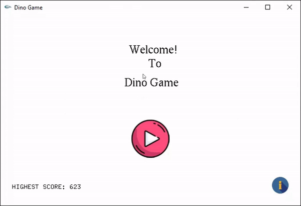

# DinoGame
The DinoGame is developed using iGraphics library(C++)

## Requirement
- Visual Studio 2010/2013

## Note
A documentation of iGraphics (from "S. M. Shahriar Nirjon") is added with the project. Required files for iGraphics is also added.

## Demo

